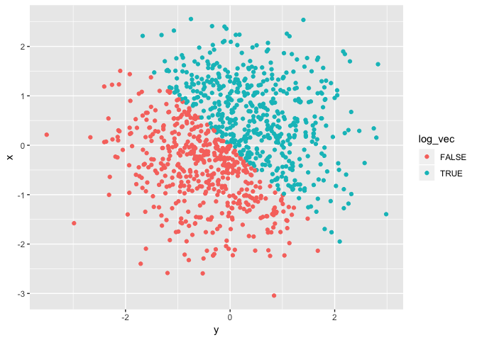
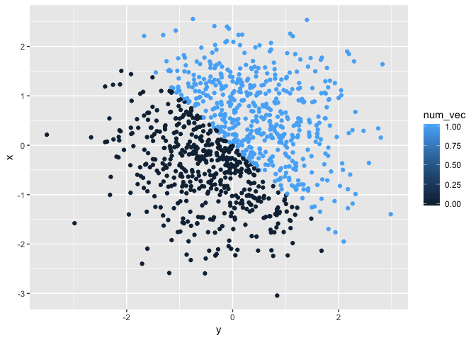
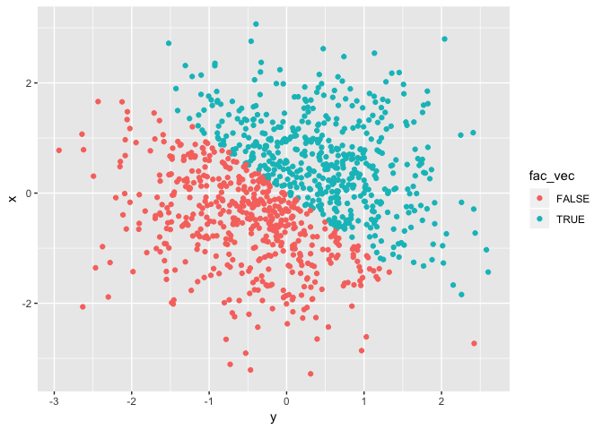

p8105\_hw1\_ja3314
================
Jaisal Amin

Problem 1
---------

**Creating data frame**

``` r
uniform_dist_df = tibble(
  vec_numeric = runif(10, min = 0, max = 5), 
  vec_logical = c(vec_numeric > 2), 
  vec_char = c("a", "b", "c", "d", "e", "f", "g", "h", "i", "j"), 
  vec_factor = factor(c(1,0,0,1,1,1,0,1,0,0), levels = c(0,1), labels = c("positive", "negative"))
)
```

**Calculating the mean of each variable in uniform\_dist\_df:**

``` r
summarise_at(uniform_dist_df, c("vec_numeric", "vec_logical", "vec_char", "vec_factor"), mean)
```

    ## # A tibble: 1 x 4
    ##   vec_numeric vec_logical vec_char vec_factor
    ##         <dbl>       <dbl>    <dbl>      <dbl>
    ## 1        3.07         0.6       NA         NA

The mean calculation only works for the numeric and logical vectors. The character and factor vectors do not contain numeric values and hence a mean cannot be calculated. The logical vector values are coerced to numeric and therefore a value has been calculated.

**Converting logical, character, and factor vectors into numeric vectors:**

``` r
as.numeric(uniform_dist_df$vec_logical)
as.numeric(uniform_dist_df$vec_char)
as.numeric(uniform_dist_df$vec_factor)
```

The logical and factor vector are able to be converted to numeric values but the character vector is not.

**Converting character variable from character to factor to numeric and factor variable from factor to character to numeric**

``` r
char_factor_numeric = as.factor(uniform_dist_df$vec_char)
as.numeric(char_factor_numeric)
```

    ##  [1]  1  2  3  4  5  6  7  8  9 10

``` r
factor_char_numeric = as.character(uniform_dist_df$vec_factor)
as.numeric(factor_char_numeric)
```

    ##  [1] NA NA NA NA NA NA NA NA NA NA

Converting a character vector to a factor vector and then using the `as.numeric` function produces a numeric factor however converting a factor vector to a character vector does not.

Problem 2
---------

**Creating data frame:**

``` r
norm_dist_df = tibble(
  x = rnorm(1000), 
  y = rnorm(1000), 
  log_vec = x + y > 0, 
  num_vec = as.numeric(log_vec), 
  fac_vec = as.factor(log_vec), 
)
```

This vector's dimensions are \[1000, 5\]. x has a mean of 0.0628697 and a median of 0.073864. The proportion of `TRUE` cases in the logical vector is 0.513.

**Creating scatterplots:**

*Color-coded based on logical variable:*

``` r
ggplot(norm_dist_df, aes(x = y, y = x, color = log_vec)) + geom_point()
```



``` r
ggsave("norm_dist_plot.pdf")
```

*Color-coded based on numeric variable:*

``` r
ggplot(norm_dist_df, aes(x = y, y = x, color = num_vec)) + geom_point()
```



*Color-coded based on factor variable:*

``` r
ggplot(norm_dist_df, aes(x = y, y = x, color = fac_vec)) + geom_point()
```



Since the values for my logical and factor variables are the same, their plots are also color-coded the same way. Even though the numeric variable only has 2 possible values, the color-coding for the scatterplot is a gradient since there is a potential for more than 2 variables in a numeric vector.
